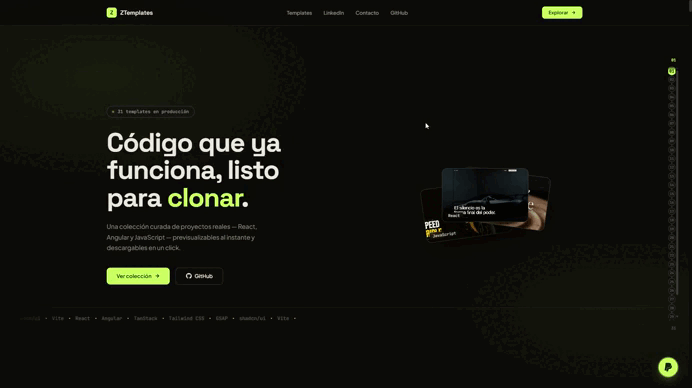

<h1 align="center">
  <span style="color:#7C3AED">🗂️</span>
  <span> Z</span><span style="color:#7C3AED">Templates</span>
</h1>

<p align="center">
  Por si quieres ver — <a href="https://templates.cesarsobrino.es/"><strong>Live Demo</strong></a>
</p>

<p align="center">
  
</p>

Galería web construida con **Angular 21** que actúa como portal/portainer de templates frontend. Permite explorar, previsualizar en vivo y descargar proyectos template listos para producción.

---

## ¿Qué hace?

- Muestra una cuadrícula de cards animadas, una por cada template disponible.
- Cada card incluye nombre, descripción, tecnologías, imagen de portada y GIF animado al hacer hover.
- El botón **Ver Demo** abre el template prebuildado directamente en el navegador (nuevo tab).
- El botón **Descargar** descarga el archivo `descarga.zip` del template.
- Registra visitas y descargas a través de una API externa (`TemplateTrackingService`).

---

## Estructura del proyecto

```
ZTemplates/
├── angular.json                  # Configuración del workspace Angular
├── package.json                  # Dependencias y scripts npm
├── scripts/
│   └── generate-templates.js     # Script Node que genera public/templates.json
├── public/
│   ├── templates.json            # Generado automáticamente — lista de templates
│   └── templates/                # Cada subcarpeta es un template independiente
│       ├── mi-template/
│       │   ├── languages.json    # Metadatos del template (nombre, descripción, techs…)
│       │   ├── portada.png       # Imagen de portada (opcional)
│       │   ├── portada_gif.gif   # GIF animado para hover (opcional)
│       │   ├── descarga.zip      # Archivo descargable (opcional)
│       │   └── dist/             # Build del template (index.html + assets)
│       └── ...
└── src/
    └── app/
        ├── app.ts                # Componente raíz (lógica + animaciones)
        ├── app.html              # Template HTML de la galería
        ├── app.css               # Estilos del portal
        ├── app.config.ts         # Providers Angular (router, HTTP, PrimeNG)
        └── services/
            └── template-tracking.service.ts  # Tracking de visitas/descargas
```

---

## Templates incluidos

Más de 30 templates listos para producción, la mayoría construidos con **React 19 + TanStack Start + shadcn/ui**:

| Template | Framework | Tecnologías destacadas |
|---|---|---|
| **Æther GT** | React | TanStack Start, TanStack Router, TanStack Query, Tailwind CSS, shadcn/ui, GSAP, Lenis |
| **Aether** | React | TanStack Start, TanStack Router, TanStack Query, Tailwind CSS, shadcn/ui, GSAP, Lenis |
| **Aura** | React | TanStack Start, TanStack Router, TanStack Query, Tailwind CSS, shadcn/ui, GSAP |
| **Aurum** | React | TanStack Start, TanStack Router, TanStack Query, Tailwind CSS, shadcn/ui, GSAP, Lenis |
| **Dachshund** | React | TanStack Start, TanStack Router, TanStack Query, Tailwind CSS, shadcn/ui, GSAP |
| **Ember Gaming Chairs** | React | TanStack Start, TanStack Router, TanStack Query, Tailwind CSS, shadcn/ui, GSAP, Lenis |
| **Fontanería** | React | TanStack Start, TanStack Router, TanStack Query, Tailwind CSS, shadcn/ui |
| **Friengess** | React | TanStack Start, TanStack Router, TanStack Query, Tailwind CSS, shadcn/ui, GSAP, Framer Motion |
| **FrikiForge** | React | TanStack Start, TanStack Router, TanStack Query, Tailwind CSS, shadcn/ui, GSAP |
| **Hojas de Autor** | React | TanStack Start, TanStack Router, TanStack Query, Tailwind CSS, shadcn/ui, GSAP |
| **Horologe** | React | TanStack Start, TanStack Router, TanStack Query, Tailwind CSS, shadcn/ui, GSAP, Lenis |
| **Kicks Lab** | React | TanStack Start, TanStack Router, TanStack Query, Tailwind CSS, shadcn/ui, GSAP |
| **Kryo Lab** | React | TanStack Start, TanStack Router, TanStack Query, Tailwind CSS, shadcn/ui, GSAP |
| **Kuro Omakase** | React | TanStack Start, TanStack Router, TanStack Query, Tailwind CSS, shadcn/ui, GSAP |
| **La Vetrina d'Oro** | React | TanStack Start, TanStack Router, TanStack Query, Tailwind CSS, shadcn/ui, GSAP |
| **Maurié** | React | TanStack Start, TanStack Router, TanStack Query, Tailwind CSS, shadcn/ui, GSAP |
| **Neonic** | React | TanStack Start, TanStack Router, TanStack Query, Tailwind CSS, shadcn/ui, GSAP, Motion |
| **O'Henal** | React | TanStack Start, TanStack Router, TanStack Query, Tailwind CSS, shadcn/ui, GSAP |
| **PharmaModern** | React | TanStack Start, TanStack Router, TanStack Query, Tailwind CSS, shadcn/ui |
| **Portfolio** | React | Vite, Tailwind CSS, shadcn/ui, Framer Motion, React Router, TanStack Query |
| **Axon** | React | TanStack Start, TanStack Router, TanStack Query, Tailwind CSS, shadcn/ui, GSAP, Framer Motion |
| **Azul** | React | TanStack Start, TanStack Router, TanStack Query, Tailwind CSS, shadcn/ui, GSAP, Framer Motion |
| **Forma** | React | TanStack Start, TanStack Router, TanStack Query, Tailwind CSS, shadcn/ui, GSAP, Motion |
| **Grasa & Gloria** | React | TanStack Start, TanStack Router, TanStack Query, Tailwind CSS, shadcn/ui, GSAP |
| **Vanguard** | React | TanStack Start, TanStack Router, TanStack Query, Tailwind CSS, shadcn/ui, GSAP, Lenis |
| **Optika** | React | TanStack Start, TanStack Router, TanStack Query, Tailwind CSS, shadcn/ui, GSAP |
| **Módulo** | React | TanStack Start, TanStack Router, TanStack Query, Tailwind CSS, shadcn/ui, GSAP, Lenis |
| **Kinetic** | React | TanStack Start, TanStack Router, TanStack Query, Tailwind CSS, shadcn/ui, GSAP, Framer Motion |
| **Teviso** | React | TanStack Start, TanStack Router, TanStack Query, Tailwind CSS, shadcn/ui, GSAP, Lenis |
| **X-Forge** | React | TanStack Start, TanStack Router, TanStack Query, Tailwind CSS, shadcn/ui, GSAP |
| **Animations 3D** | JavaScript | Three.js, GSAP, Lenis, Vite |

> La lista completa y actualizada se genera automáticamente en `public/templates.json` a partir de las carpetas de `public/templates/`.

---

## Cómo añadir un nuevo template

1. Crea una carpeta en `public/templates/<nombre-del-template>/`.
2. Añade un `languages.json` con los metadatos:
   ```json
   {
     "name": "Mi Template",
     "description": "Descripción corta del template.",
     "language": "React",
     "technologies": ["React", "Vite", "Tailwind CSS"]
   }
   ```
3. Coloca el build del proyecto dentro (por ejemplo `dist/index.html` + assets).
4. Opcionalmente añade `portada.png`, `portada_gif.gif` y `descarga.zip`.
5. Ejecuta `npm start` — el script `generate-templates.js` reconstruye `templates.json` automáticamente.

---

## Scripts npm

| Comando | Descripción |
|---|---|
| `npm start` | Genera `templates.json` y levanta el servidor de desarrollo Angular |
| `npm run build` | Genera `templates.json` y compila la aplicación para producción |
| `npm run watch` | Build en modo watch (configuración `development`) |
| `npm run deploy` | Publica el `dist/` en GitHub Pages (`angular-cli-ghpages`) |
| `npm test` | Ejecuta los tests con Vitest |

> `generate-templates.js` se ejecuta como paso `pre` antes de `start` y `build`.

---

## Tecnologías del portal

| Paquete | Versión |
|---|---|
| Angular | ^21.1 |
| PrimeNG | ^21.1 |
| @primeng/themes | ^21.0 |
| @primeuix/themes (Aura) | ^2.0 |
| GSAP | ^3.15 |
| TypeScript | ~5.9 |
| Vitest | ^4.0 |

---

## Script `generate-templates.js`

Lee cada subcarpeta de `public/templates/`, detecta automáticamente el tipo de build y genera `public/templates.json`.

- **TanStack Start**: detecta `dist/client/assets/` y genera un `index.html` que carga el bundle correcto (el JS más grande es el entry point).
- **Vite / CRA estándar**: busca `dist/index.html` o `build/index.html` y convierte rutas absolutas (`/assets/…`) a relativas (`./assets/…`) para que funcionen servidas desde subcarpetas.
- **Sin build**: usa `index.html` en la raíz si existe.

---

## Variables de entorno

El tracking de visitas apunta a:

```typescript
// src/environments/environment.ts
export const environment = {
  production: false,
  apiUrl: 'http://localhost:5300'
};
```

En producción (`environment.prod.ts`) apunta a `https://cesarsobapigateway.up.railway.app`. Cambia `apiUrl` en cada fichero según el entorno.

---

## Prerequisitos

- Node.js ≥ 20
- npm ≥ 11
- Angular CLI 21 (`npm i -g @angular/cli`)
